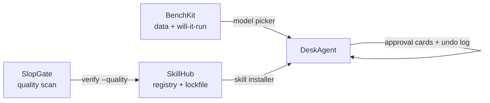
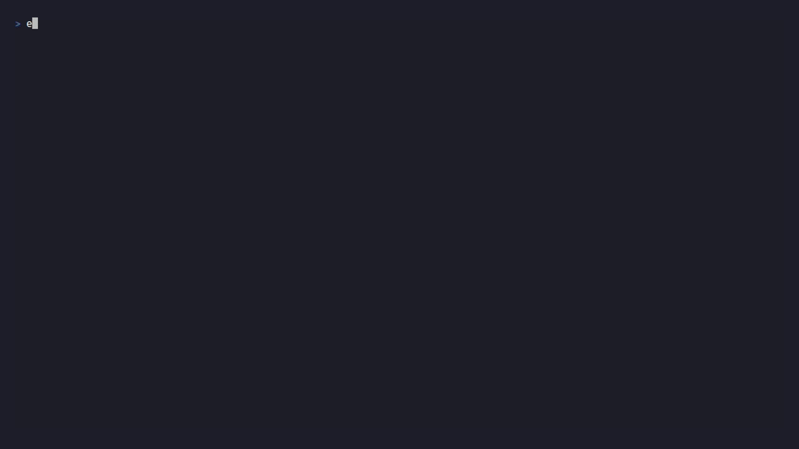
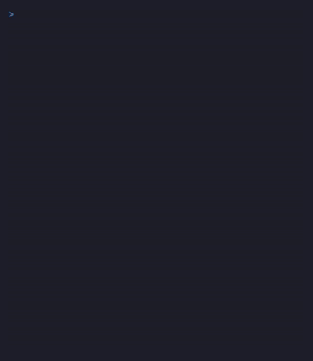

# The Synergy Build — agent-ecosystem

A monorepo building four interoperable products around the agent/AI ecosystem, driven by a **content-locked build plan**.

> **Status legend:** ✅ Complete · 🔄 In progress · ⏸️ Deferred
> Phases 1–8 **✅ COMPLETE** (Milestone 1 accepted) · Milestone 2 in progress — Phases 9–10 **🔄 pending**

## Start here

New to the repo? Three ways in:

- **Pick a product** — see the [product map](#products) below and open its directory.
- **Run all checks** — `bash scripts/run-all-checks.sh` (20 checks, one exit code; the CI surrogate).
- **See it work** — run a [demo](#demos); every demo is offline and end-to-end.

Full plan and locked constraints: [`PHASES.md`](PHASES.md). Execution status and change requests: [`PROGRESS.md`](PROGRESS.md). Per-phase handoff records: [`records/`](records/).

## Products

Four interoperable products (one directory per product, DEC-0001). See [`apps/README.md`](apps/README.md) for the full per-app breakdown.

| Product | Dir | What it is | Links |
|---------|-----|------------|-------|
| **BenchKit** | `apps/bench-site` | Local-inference benchmark dataset, "will-it-run" calculator, searchable matrix site | [read product docs](apps/bench-site/README.md) |
| **SkillHub** | `apps/skillhub-cli`, `apps/skillhub-registry`, `apps/skillhub-web` | Cross-harness skill package manager + registry + security scanner | [CLI](apps/skillhub-cli/README.md) · [registry](apps/skillhub-registry/README.md) · [web](apps/skillhub-web/README.md) |
| **SlopGate** | `apps/slopgate`, `apps/slopgate-action`, `apps/slopgate-dash` | Anti-slop lint rules, 0–100 score, CI PR gate | [core](apps/slopgate/README.md) · [action](apps/slopgate-action/README.md) · [dash](apps/slopgate-dash/README.md) |
| **DeskAgent** | `apps/deskagent` | Local-first personal agent with self-memory (DEC-0009): Tauri 2 + React desktop shell **and** a ratatui terminal UI (`crates/deskagent-cli`) over the same Rust core | [read product docs](apps/deskagent/README.md) · [TUI demo GIF](apps/deskagent/docs/assets/deskagent-tui-demo.gif) |

## Architecture



Integration bullets (source: [`apps/README.md`](apps/README.md) Ecosystem section):

- BenchKit data + `will-it-run` feed **DeskAgent's** model picker (live fetch, bundled offline fallback).
- **SkillHub** registry + lockfile format feed **DeskAgent's** in-app skill installer (skills surface as procedural memory).
- **SlopGate** scanner feeds **SkillHub's** optional `verify --quality` check (quality score on skill pages).
- Approval cards + shared undo log gate every DeskAgent memory write and risky action (DEC-0009).

## Plan lock

The plan is **content-locked**: agents may tick checkboxes/status only; humans own content changes and the re-lock ceremony.

| File | Role |
|------|------|
| `PHASES.md` | The build plan. **Content-locked.** Agents: checkboxes/status only. |
| `PLAN.lock` | Lock manifest: content hash + approval token hash + approval history. |
| `PROGRESS.md` | Agent-writable execution status and change requests. |
| `scripts/plan-lock.sh` | `verify \| status \| propose \| init \| approve \| check-staged \| check-push`. |

> **⚠️ Who may run what**
> **Agents:** `verify`, `status`, `propose`, `check-staged`, `check-push` only.
> **Humans only:** `approve` (and `init` on first setup) — both require an interactive terminal and the approval token.

**Commands:**

```bash
# Agent-safe (run freely):
bash scripts/plan-lock.sh verify     # integrity check — must pass before/after every phase
bash scripts/plan-lock.sh status     # lock info + open change requests
bash scripts/plan-lock.sh propose "why"  # agents' only channel to request a plan change

# HUMAN ONLY — requires interactive terminal + typing APPROVE:
bash scripts/plan-lock.sh approve "why"  # re-lock after an approved content change
```

**Approval ceremony for plan changes (humans only):**

1. Agent runs `propose "<reason>"` → request lands in `PROGRESS.md`.
2. Human edits `PHASES.md` (or tells the agent exactly what to write and approves it).
3. Human runs `scripts/plan-lock.sh approve "<reason>"` from an interactive terminal, types `APPROVE`.
4. Lock re-hashes; `verify` passes again.

Git hooks (pre-commit/pre-push) block any commit that changes `PHASES.md` content or `PLAN.lock` unless
`PLAN_APPROVAL_TOKEN` (the human-held token) is in the environment. Install with
`bash hooks/install-hooks.sh`.

## Layout

```
apps/            one directory per product (DEC-0001)
shared/
  schemas/       JSON schemas (benchmark-result, skill-manifest)
  specs/         markdown specs (skill-manifest-spec-v1)
  datasets/      seeded benchmark data
scripts/         plan-lock.sh, verify-env.sh, run-all-checks.sh
records/         per-phase handoff records
```

## Status

Phases 1–8 are **✅ COMPLETE** (Milestone 1 accepted; Milestone 2 in progress — Phases 9–10 **🔄 pending**).
Every product is built, validated, and cross-wired:

- BenchKit data + `will-it-run` feed **DeskAgent's** model picker (live fetch, bundled offline fallback).
- **SkillHub** registry + lockfile format feed **DeskAgent's** in-app skill installer (skills surface as procedural memory).
- **SlopGate** scanner feeds **SkillHub's** optional `verify --quality` check (quality score on skill pages).
- Approval cards + shared undo log gate every DeskAgent memory write and risky action (DEC-0009).
- DeskAgent chats with a real local model (Ollama/llama.cpp adapters; live-verified).
- **Phase 8:** the DeskAgent CLI (`crates/deskagent-cli`) ships a four-pane ratatui terminal UI
  (Chat / Memory+Approvals / Models / Tasks) mirroring the web tabs, plus headless subcommands
  (`chat`, `models`, `approvals`, `memory`, `persona`, `export`, `wipe`). It reuses the core exactly
  as the Tauri shell does — same data dir, same at-rest encryption key policy. The Tauri GUI still
  compiles and is explicitly **⏸️ deferred**; the CLI is the supported desktop surface.

## Demos

All demos run offline and end-to-end from the repo root. See [`scripts/demos/README.md`](scripts/demos/README.md) for details.

| Demo | Command | Shows | Prereq |
|------|---------|-------|--------|
| BenchKit | `node scripts/demos/benchkit-demo.mjs` | dataset rows (DEC-0006 sources) + will-it-run verdicts | Node.js |
| SkillHub | `bash scripts/demos/skillhub-install-demo.sh` | publish → install → `verify --quality` | Bash (starts its own registry on an ephemeral port) |
| SlopGate | `bash scripts/demos/slopgate-gate-demo.sh` | fixture scores + CI gate exit codes (threshold 50) | Bash |
| DeskAgent | `bash scripts/demos/deskagent-approval-demo.sh` | capture → approve/reject → sandbox + undo → skill install → citations | Bash |
| DeskAgent TUI | `vhs scripts/demos/deskagent-tui-demo.tape` | four-pane TUI walkthrough: live chat → inline approvals → models → tasks (renders the GIF below) | [vhs](https://github.com/charmbracelet/vhs) + local Ollama |
| DeskAgent TUI (mobile) | `vhs scripts/demos/deskagent-tui-mobile-demo.tape` | narrow portrait walkthrough: compact layout, mobile keys, live chat (renders the mobile GIF below) | [vhs](https://github.com/charmbracelet/vhs) + local Ollama |

DeskAgent CLI (Phase 8):

```bash
cd apps/deskagent && cargo run -p deskagent-cli                 # four-pane TUI
cd apps/deskagent && cargo run -p deskagent-cli -- chat "Hello" # headless chat
```

**Live model path (opt-in):** `cargo test -p deskagent-core -- --ignored ollama_live` with a running Ollama.

## Visual assets

DeskAgent's four-pane terminal UI, captured at 16:9 from an isolated store against a local Ollama
(model replies are live):



The same TUI on a narrow terminal (~46×27, as in the Moshi iOS app over SSH): compact tab labels,
mobile-first status bar, and `1`–`4` pane switching:



Screenshots of BenchKit, SkillHub, SlopGate, and the DeskAgent shell are still pending. When added,
store them under a product asset path (e.g. `apps/*/docs/assets/`) at 16:9 with descriptive alt text,
and link them from the product rows above. The GIF is reproducible from `scripts/demos/deskagent-tui-demo.tape`.
